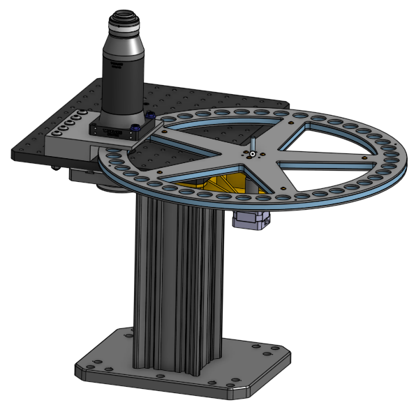
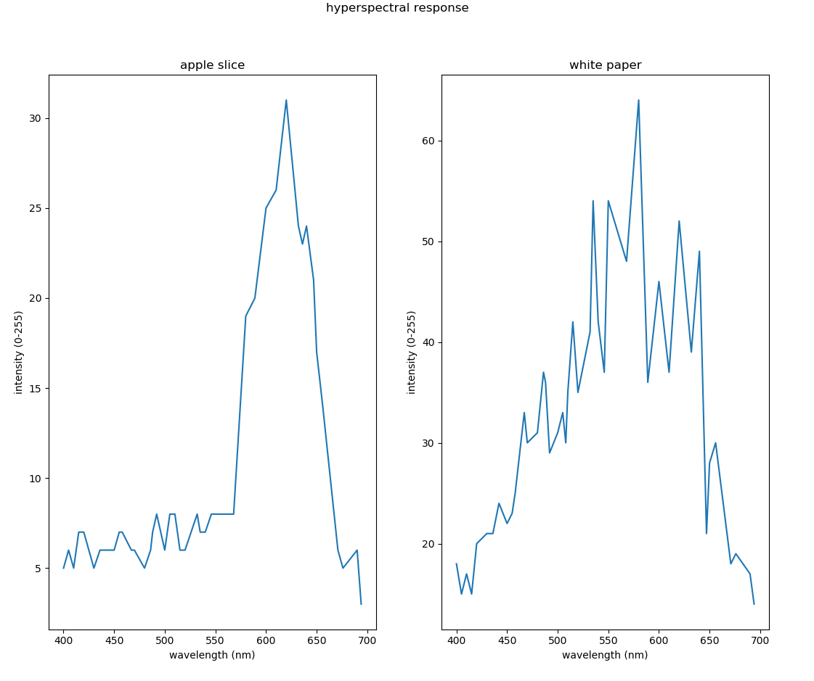

# automated_filter_wheel
This project is an automated filter wheel mounted on a Thorlab microsope, using a TinyG board to control the rotation of the filter wheel. You can see a demo video here: 

## Hardware
This setup is designed for ThorLab microsopes. It can be easily reproduced because most of the parts are 3D printed and only the wheel is laser-cutted. You can find the CAD model of the whole setup here: [CAD model](https://cad.onshape.com/documents/84bf8d180e0effdf76638ad0/w/827d3cb2b0088bec7e312b7a/e/803dfbafcbe03560cc7d7d4e)

## Software
This project uses a TinyG board to do the control, which is a board specifically designed for CNC machines and stepper motors.

### Connecting to TinyG Board
Before using this code to communicate with the TinyG board, it's better we test the connection between our computer and TingG board is fine by using another software called [coolterm](https://github.com/synthetos/TinyG/wiki/Connecting-TinyG).

### TinyG Board Configuration
There are some default configurations you don't need to worry too much about, and one special configuration specific configured to this project.

default configuration

    $1ma=0    Maps motor 1 to the X axis
    $2ma=1    Maps motor 2 to the Y axis
    $3ma=2    Maps motor 3 to the Z axis
    $4ma=1    Maps motor 4 to the Y axis
In my case, I wired my motor to motor 1(marked on the board), so all the configuration I care about is $1**=**

special configuration

    $1tr=360
After setting the Travel per Revolution of the motor you're using to 360, the code will work fine, since the code will translate amount traveled into angle to desired filter internally.

After setting the special configuration, the code will work fine as expected.

### Means to run the code
After connecting the TinyG board, type in command below to give permission to the port:

    sudo chmod a+rw /dev/ttyUSB0
Then you have two ways to run the code. 
1. Run the jupyter notebook(tinyg.ipynb) directly, or
2. Import tinyg.py as a library. 

For the second method, you would write code like this:
    
    import tinyg
    tg = tinyg.tinyg()
    tg.open("/dev/ttyUSB0")
    tg.cycle_44_filters()

## Hyperspectral Response of an Apple Slice
Using the pictures in the sample_pictures folder and code in plot.py, you can get the comparsion between the hyperspectral response of a pixel on an apple slice and a pixel on a white paper. Here is the result: 